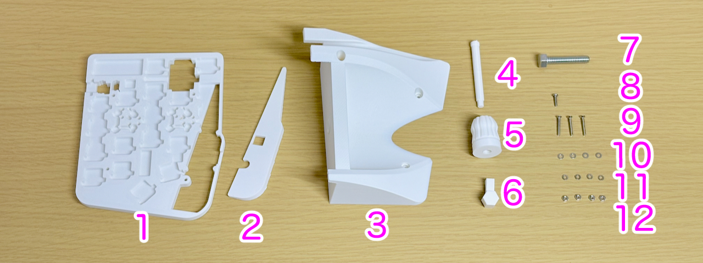
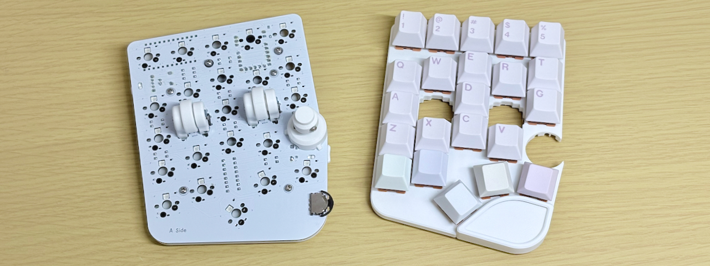
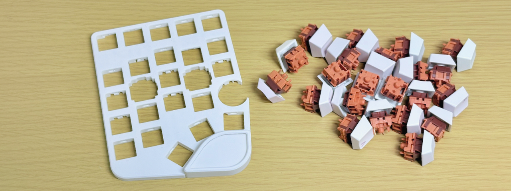
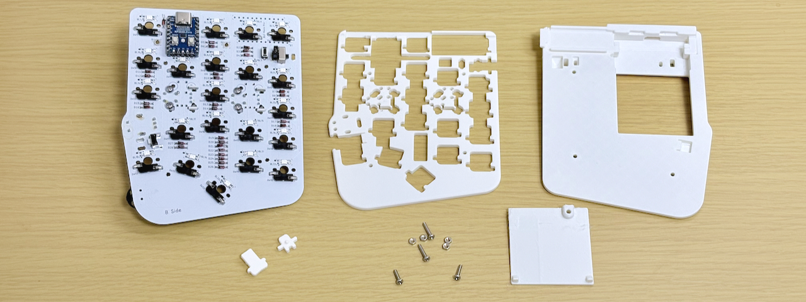
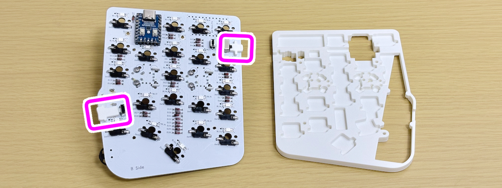

# Adapter for Cintiq Pro Assembly Guide ([日本語](./CINTIQ.md))

## Preparation
### What to need
- Handyman v2 
- [Adaptor for Cintiq Pro](https://tarohayashi.booth.pm/items/7544767)

### Tool required
 - Screwdriver

## Verification of Contents

<table>
    <tr>
        <td>1</td>
        <td>Bottom plate</td>
        <td>1</td>
        <td></td>
        <td>5</td>
        <td>Bolt cover</td>
        <td>1</td>
        <td></td>
        <td>9</td>
        <td>15mm screw</td>
        <td>3</td>
        <td></td>
    </tr>
    <tr>
        <td>2</td>
        <td>Spacer</td>
        <td>1</td>
        <td></td>
        <td>6</td>
        <td>Crank</td>
        <td>1</td>
        <td></td>
        <td>10</td>
        <td>Washer</td>
        <td>4</td>
        <td></td>
    </tr>
    <tr>
        <td>3</td>
        <td>Adaptor</td>
        <td>1</td>
        <td></td>
        <td>7</td>
        <td>32mm Bolt</td>
        <td>1</td>
        <td></td>
        <td>11</td>
        <td>Spring Washer</td>
        <td>4</td>
        <td></td>
    </tr>
    <tr>
        <td>4</td>
        <td>Nut pusher</td>
        <td>1</td>
        <td></td>
        <td>8</td>
        <td>8mm screw</td>
        <td>1</td>
        <td></td>
        <td>12</td>
        <td>Nuts</td>
        <td>4</td>
        <td></td>
    </tr>
</table>

## Disassembly and Assembly

Thread the 8mm screw and 15mm screw onto the spring washer and washer in that order.

Pull off the knob cover. Be careful not to lose the small acrylic cap.

Remove the switch plate. While you can remove them all at once, for safety, remove each switch individually.

Remove all switches from the switch plate for installation.

Remove the screws and detach the parts shown in the image.

Place the two small parts that attach to the slide switch and side button.

Place the bottom plate and secure it at one point using an 8mm screw and nut.

Place the spacer.

Place the adapter and secure it in three places using 15mm screws and nuts.

Using a nut pusher makes it easier to tighten nuts in hard-to-reach places.

Place the switch plate over the switch and attach it from all four corners.

All switches were installed without bending the pins.

Attach the bolt cover to the 32mm bolt.

Attach it to the screw mount on the left side of the Cintiq Pro.

Using a wrench allows you to tighten it more securely.

The crank can be stored inside the main unit.

You can also store the nut pusher.

Installation complete.

[Back to Start Page](../README.md)
