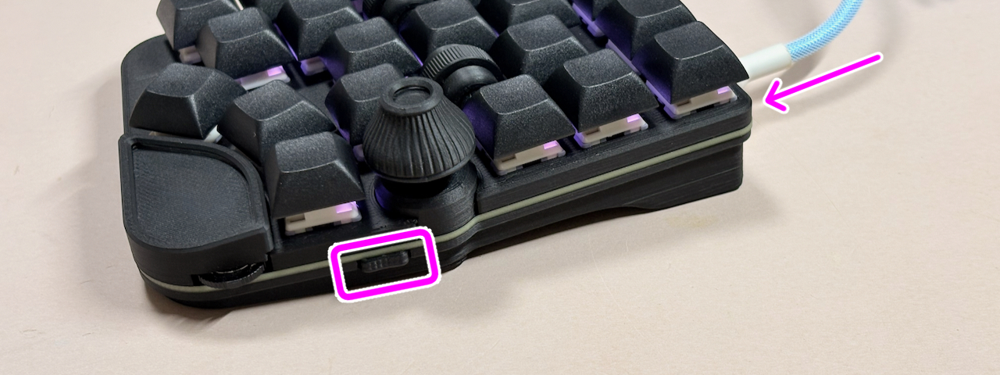

# Handyman マクロパッド v2 完成品 のセットアップ

## 必要なもの
- [データ転送対応のType-C USBケーブル](https://amzn.to/3XS9qRu)

## 内容品の確認

### 本体

### 無線化の袋(使用しませんが内容品を確認します。)

<table>
    <tr>
        <th>番号</th>
        <th>部品名（保守品リンク）</th>
        <th>数量</th>
        <th></th>
    </tr>
    <tr>
        <td>1</td>
        <td>BMPカバー</td>
        <td>1</td>
        <td></td>
    </tr>
    <tr>
        <td>2</td>
        <td>電池ボックスアダプター</td>
        <td>2</td>
        <td>左右があります。</td>
    </tr>
    <tr>
        <td>3</td>
        <td>USBキャップ</td>
        <td>1</td>
        <td></td>
    </tr>
    <tr>
        <td>4</td>
        <td><a href="https://www.monotaro.com/p/5055/4884/">8mmネジ</a></td>
        <td>2</td>
        <td>M2x8</td>
    </tr>
    <tr>
        <td>5</td>
        <td><a href="https://www.monotaro.com/p/2876/4087/">ワッシャー</a></td>
        <td>4</td>
        <td>M2</td>
    </tr>
    <tr>
        <td>6</td>
        <td><a href="https://www.monotaro.com/p/2344/7646/">スプリングワッシャー</a></td>
        <td>2</td>
        <td>M2</td>
    </tr>
    <tr>
        <td>7</td>
        <td><a href="https://www.monotaro.com/p/2876/3414/">ナット</a></td>
        <td>2</td>
        <td>M2</td>
    </tr>
</table>

### セットアップ
こちらのファイルをダウンロードします。
- [tarohayashi_handyman_v2_default.uf2](https://github.com/Taro-Hayashi/Handyman-v2/releases/download/0.28.2/tarohayashi_handyman_v2_default.uf2)

サイドボタンを押しながらUSBケーブルでPCに接続するとドライブとして認識されます。

ドライブにダウンロードしたファイルをドラッグ&ドロップして自動的にドライブが消えたら完了です。

***
### リンク

キーの設定などカスタマイズ方法についてはこちらをご覧ください。
- [Handyman マクロパッド v2の使い方](USAGE.md)

無線化する場合はこちらをご覧ください。
- [BMP Boostを使った無線化](BMP.md)

別売オプション
- [専用リストレスト](https://tarohayashi.booth.pm/items/7544767)
- [Cintiq Pro用インチネジアダプター](https://tarohayashi.booth.pm/items/7544767)

***

## トラブルシュート

- パーツが緩くなった。

マスキングテープ等で軸や留め具を大きくすると改善することがあります。接着剤で接着することも可能です。

[Back to Start Page](../README.md)
