# Handyman マクロパッド v2 はんだ付け済み品 の組み立て方

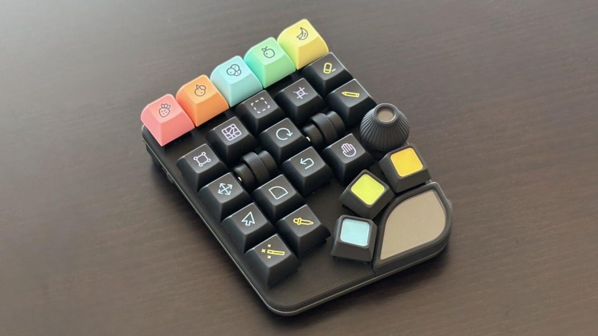

## 目次
1. [ご購入の前に](#1-ご購入の前に)
2. [内容品の確認](#2-内容品の確認)
3. [組み立て](#3-組み立て)
4. [リンク](#4-リンク)
5. [トラブルシュート](#5-トラブルシュート)

## 1. ご購入の前に
### 必要なもの
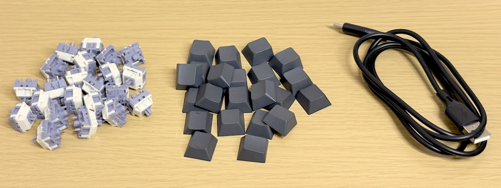
- [Cherry MX互換のキースイッチ](https://amzn.to/485V3PD) ...22
- [キースイッチに対応したキーキャップ](https://shop.yushakobo.jp/products/dsa-blank-keycaps) ...22
- [データ転送対応のType-C USBケーブル](https://amzn.to/3XS9qRu)

### 必要な工具
 - [精密ドライバー](https://amzn.to/48pxS1B0)

### 別売オプション
- [専用リストレスト](https://tarohayashi.booth.pm/items/7544767)
- [Cintiq Pro用インチネジアダプター](https://tarohayashi.booth.pm/items/7544767)

## 2. 内容品の確認

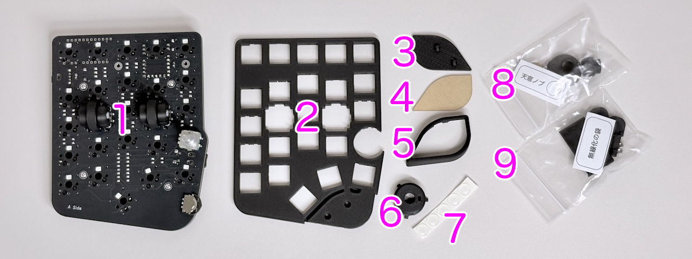
<table>
    <tr>
        <td>1</td>
        <td>本体</td>
        <td>2</td>
        <td>スイッチプレート</td>
    </tr>
    <tr>
        <td>3</td>
        <td>アクリルスタンド</td>
        <td>4</td>
        <td>アクリルプレート</td>
        <td>5</td>
        <td>アクリルカバー</td>
        <td>6</td>
        <td>エンコーダーカバー</td>
        <td>7</td>
        <td>ゴム足</td>
    </tr>
    <tr>
        <td>8</td>
        <td>天窓ノブ（24mm）の袋</td>
        <td>9</td>
        <td>無線化の袋</td>
    </tr>
</table>

### [天窓ノブ（24mm）](https://github.com/Taro-Hayashi/skylight-keycaps/blob/main/README.md)の袋
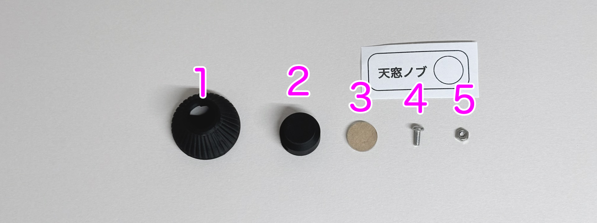
<table>
    <tr>
        <th>番号</th>
        <th>部品名（保守品リンク）</th>
        <th>数量</th>
        <th></th>
    </tr>
    <tr>
        <td>1</td>
        <td>ノブ</td>
        <td>1</td>
        <td></td>
    </tr>
    <tr>
        <td>2</td>
        <td>シャフト</td>
        <td>1</td>
        <td></td>
    </tr>
    <tr>
        <td>3</td>
        <td>アクリルプレート</td>
        <td>1</td>
        <td></td>
    </tr>
    <tr>
        <td>4</td>
        <td><a href="https://www.monotaro.com/p/5055/4866/">5mmネジ</a></td>
        <td>1</td>
        <td>M2x5mm</td>
    </tr>
    <tr>
        <td>5</td>
        <td><a href="https://www.monotaro.com/p/2876/3414/">ナット</a></td>
        <td>1</td>
        <td>M2</td>
    </tr>
</table>

### 無線化の袋(使用しませんが内容品を確認します。)
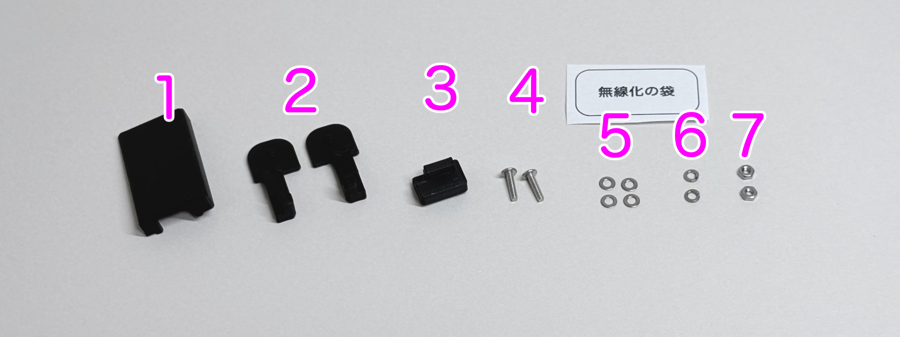
<table>
    <tr>
        <th>番号</th>
        <th>部品名（保守品リンク）</th>
        <th>数量</th>
        <th></th>
    </tr>
    <tr>
        <td>1</td>
        <td>BMPカバー</td>
        <td>1</td>
        <td></td>
    </tr>
    <tr>
        <td>2</td>
        <td>電池ボックスアダプター</td>
        <td>2</td>
        <td>左右があります。</td>
    </tr>
    <tr>
        <td>3</td>
        <td>USBキャップ</td>
        <td>1</td>
        <td></td>
    </tr>
    <tr>
        <td>4</td>
        <td><a href="https://www.monotaro.com/p/5055/4884/">8mmネジ</a></td>
        <td>2</td>
        <td>M2x8</td>
    </tr>
    <tr>
        <td>5</td>
        <td><a href="https://www.monotaro.com/p/2876/4087/">ワッシャー</a></td>
        <td>4</td>
        <td>M2</td>
    </tr>
    <tr>
        <td>6</td>
        <td><a href="https://www.monotaro.com/p/2344/7646/">スプリングワッシャー</a></td>
        <td>2</td>
        <td>M2</td>
    </tr>
    <tr>
        <td>7</td>
        <td><a href="https://www.monotaro.com/p/2876/3414/">ナット</a></td>
        <td>2</td>
        <td>M2</td>
    </tr>
</table>

### 動作の確認
こちらのファイルをダウンロードします。
- [tarohayashi_handyman_v2_default.uf2](https://github.com/Taro-Hayashi/Handyman-v2/releases/download/0.28.2/tarohayashi_handyman_v2_default.uf2)

サイドボタンを押しながらUSBケーブルでPCに接続するとドライブとして認識されます。
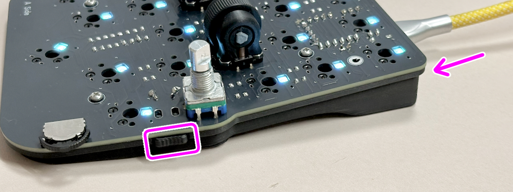

ドライブにダウンロードしたファイルをドラッグ&ドロップすると自動的にドライブが消えます。

LEDが発光することを確認し、スライドスイッチ、サイドボタン、レバーボタン、ホイール、ホイール押し込み、ダイヤル、ダイヤル押し込みに反応があることを確認します。
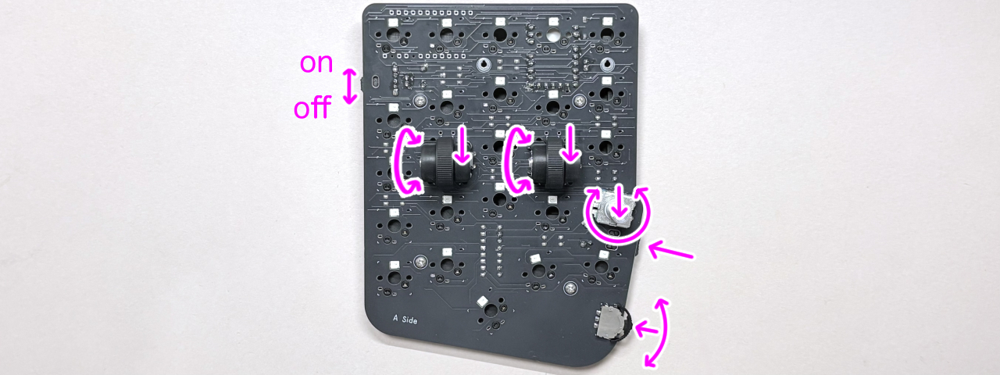

用意したスイッチの一つをソケットに差し込んで押し反応があることを確認します。
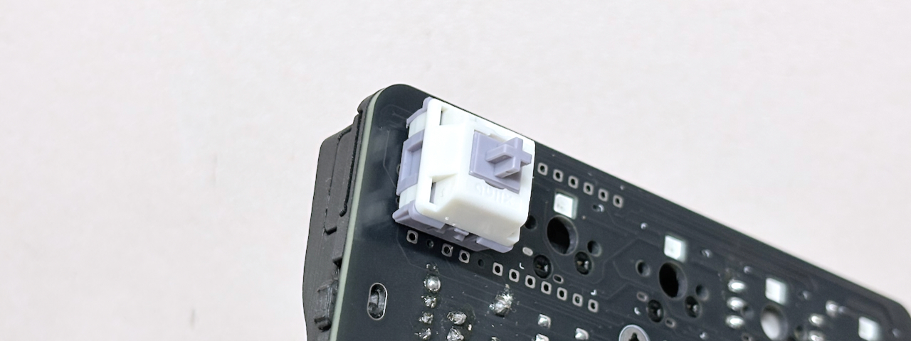
22キー分の動作を確認します。

動作に問題がある場合は[トラブルシュート](#5-トラブルシュート)の項も参考にしてください。

## 3. 組み立て
ゴム足を取り付けます。
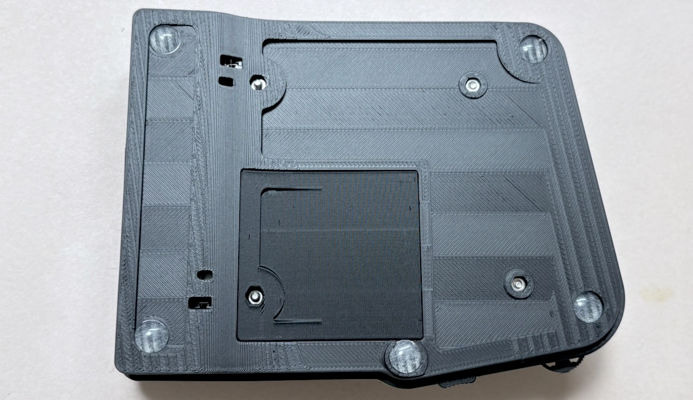
向きに気をつけてエンコーダーカバーを取り付けます。

スイッチプレートを乗せます。
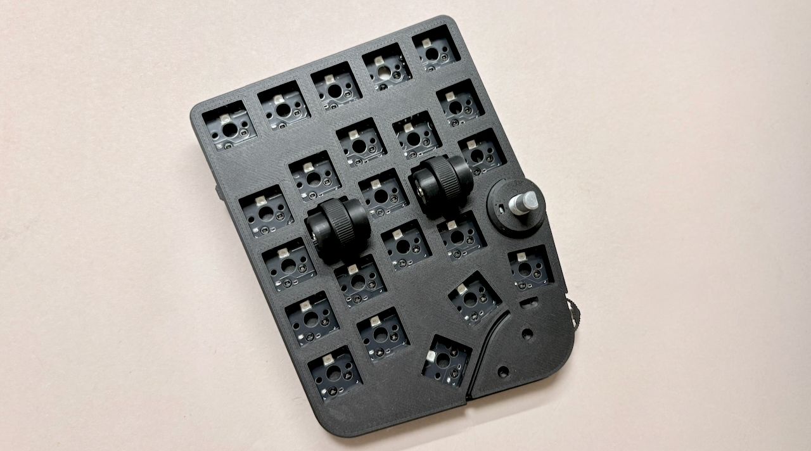
4隅から順番に全てのスイッチを取り付けます。
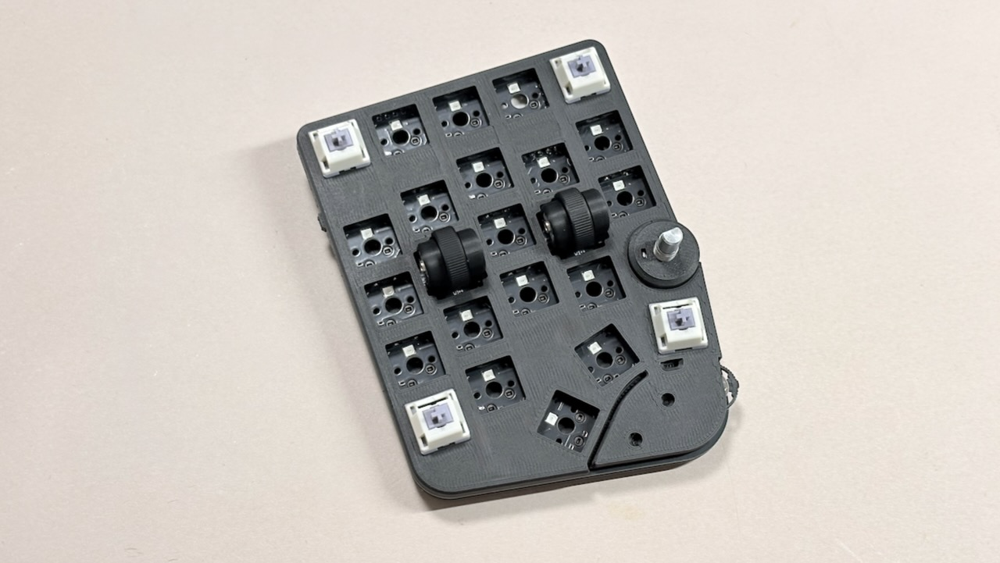
スイッチのピンが曲がらないように垂直にソケットに差し込みます。

スライドスイッチがオフになっていることを確認します。
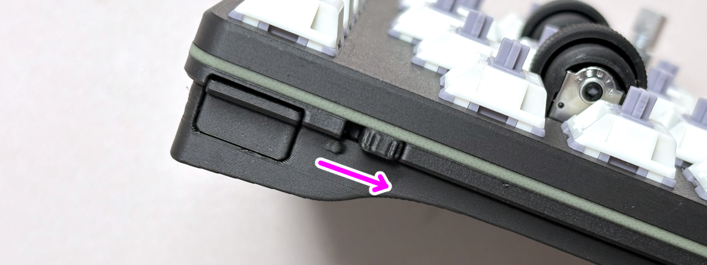
USBケーブルでPCに接続して各ボタンが動作することを確認します。
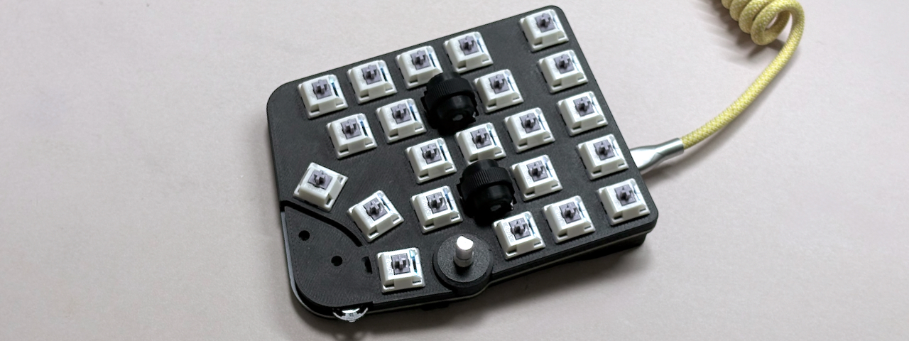
スイッチプレートにアクリルスタンドを差し込みます。

アクリルプレートの保護シールを剥がします。
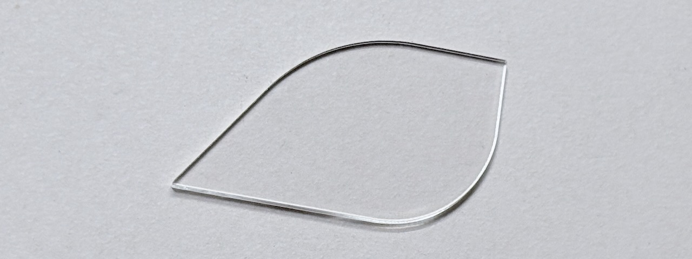
アクリルスタンドとアクリルプレートを挟むようにアクリルカバーをスイッチプレートに取り付けます。
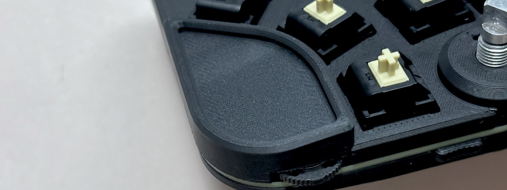
アクリルプレートを指でずらして調節しながら差し込むとスムーズに取り付けやすいです。
ステムの隙間にナットを入れ、ナットが落ちない程度に5mmネジを締めます。

ロータリーエンコーダーのシャフトに取り付けて外れなくなる程度にネジを締めます。
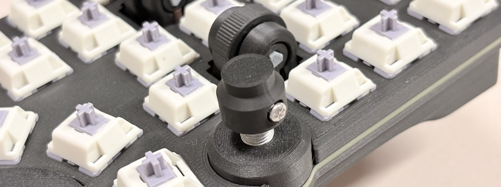
アクリルプレートの保護シールを剥がし、ノブに入れてステムに取り付けます。
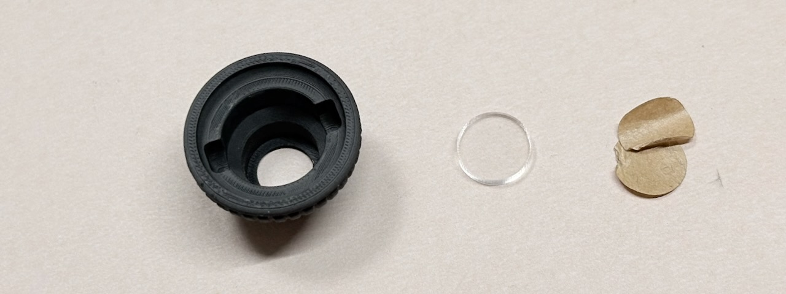
切れ込みのどちらかにネジの頭が収まるようにします。
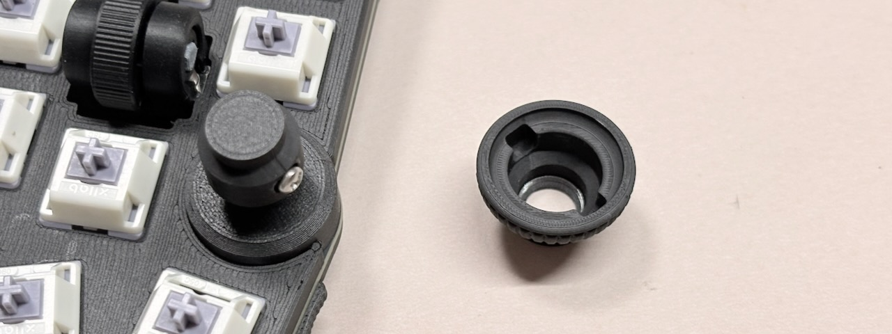
キーキャップを取り付ければ完成です。
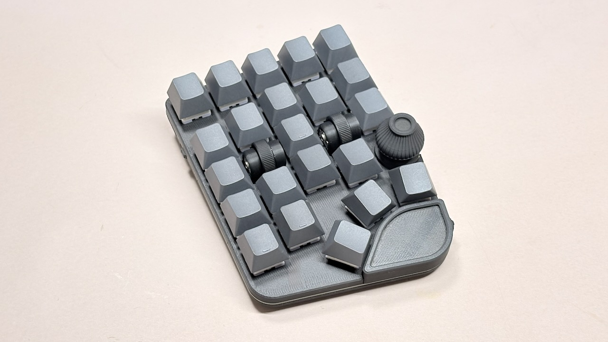

***

## 4. リンク

キーの設定などカスタマイズ方法についてはこちらをご覧ください。
- [Handyman マクロパッド v2の使い方](USAGE.md)

無線化する場合はこちらをご覧ください。
- [BMP Boostを使った無線化](BMP.md)

***

## 5. トラブルシュート

- キーが反応しない。
スイッチの足が曲がっていないかご確認ください。曲がっていた場合はピンセットやラジオペンチを使うと伸ばしやすいです。

- パーツが緩くなった。

マスキングテープ等で軸や留め具を大きくすると改善することがあります。接着剤で接着することも可能です。

- 部品が壊れた/無くなった。

基板や部品は単品で販売が可能ですのでご連絡ください。

- そのほかの不具合

はんだ付けにミスがある可能性があります。お手数ですがお問い合わせをお願いいたします。
