# Handyman マクロパッド v2 の使い方（[English](./USAGE_EN.md)）

キースイッチの他に以下の動作を設定できます。

※ON/OFFは電源ではなくスイッチのオンオフです。

## キーの入れ替え方
Google Chromeを使用してRemapに接続して、カスタマイズを選びます。

- [Remap](https://remap-keys.app/)

キーをドラッグ&ドロップして、右上の書き込みボタンを押すと設定を変更できます。
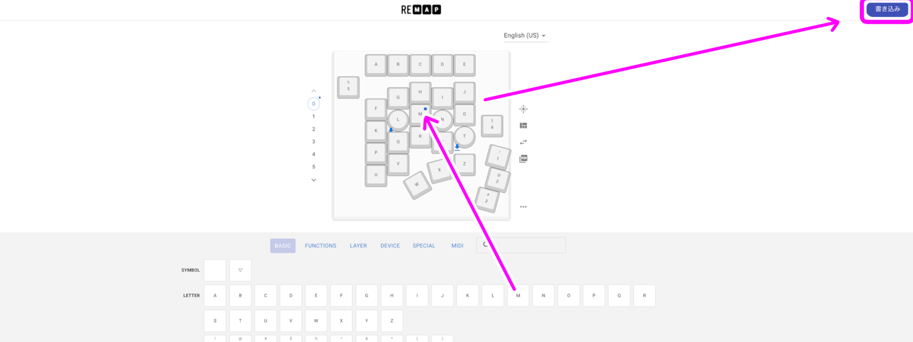

### ホイール、ダイヤルの設定
丸いアイコンで設定可能です。
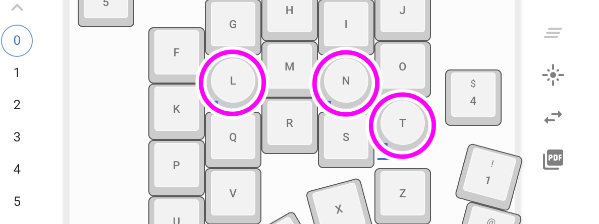

左下のマークをクリックすると時計回り回転、反時計回り回、転押し込みを設定できます。
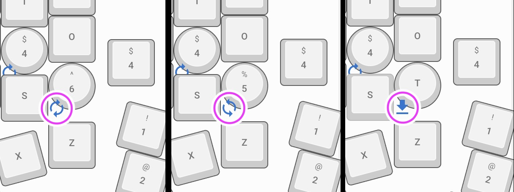

### ショートカットを使う
修飾キー（Ctrlなど）との同時押しを設定するには、設定したいキーをクリックします。
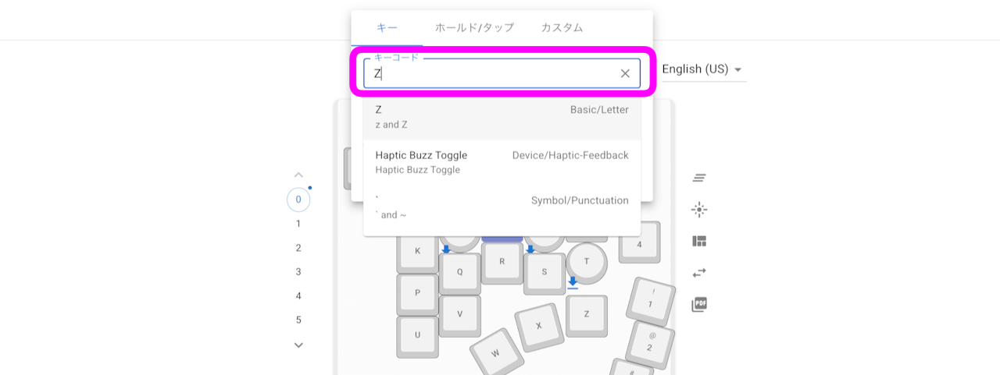
キーコードの欄に入力すると候補が出てくるのでクリックして選びます。

同時押ししたい修飾キーのチェックボックスにチェックを入れたら設定完了です。

### ホールド/タップを使う
短く押した時はキーが入力されて、押し続けると修飾キーになるような設定も可能です。
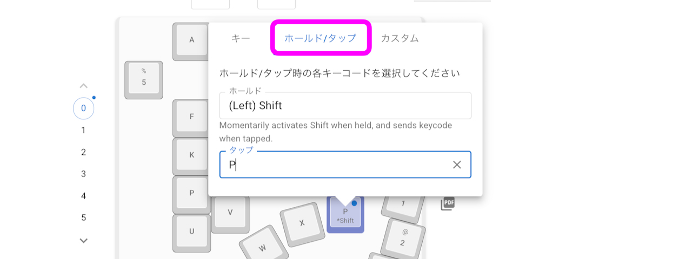
ホールド/タップのタブのホールドに修飾キー、タップに入力したいキーを設定します。

### レイヤーの設定
左の数字をクリックすると違うレイヤーのキーを設定できます。  
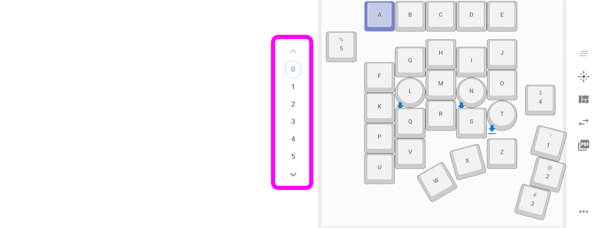
レイヤーを切り替えると設定を丸ごと変更でき、実質的にキー数を増やすことができます。
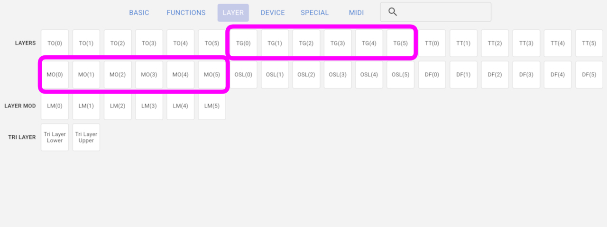
TG(数字）キーを押すとそれ以降は指定のレイヤーに切り替わります。  
MO（数字）はキーを押している間だけ指定のレイヤーに切り替えます。
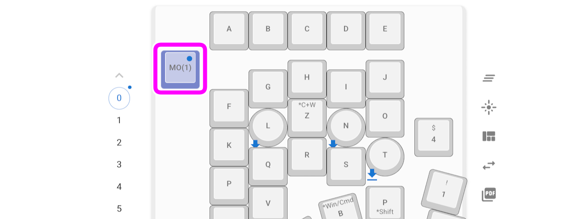
MOはノートPCのFnキーのように同時押しで別のキーとして機能させるような使い方のほか、スライドスイッチにMOを割り当てるとオンとオフで違う設定に切り替えることができて便利です。

MOを使用する場合、移行先のレイヤーの同じキーは同じMOか▽のマークを指定します。▽のキーは一時的に変更する前のレイヤーのキーを押すキーです。

### 特殊なキー
FUNCTIONSタブのVIA USER KEYにWindwosではControl、MacやiPadではCommandになる便利なキーがあります。
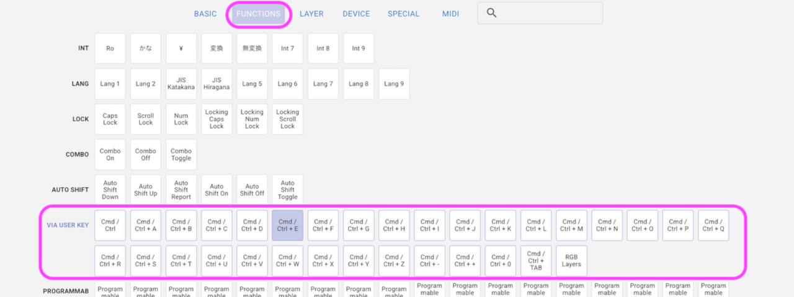
A~Z、テンキーの±、0、Tabとの同時押しのキーも用意しました。

### 設定の保存
画像のマークをクリックすると設定を保存/復元することができます。GoogleかGitHubのアカウントでログインする必要があります。
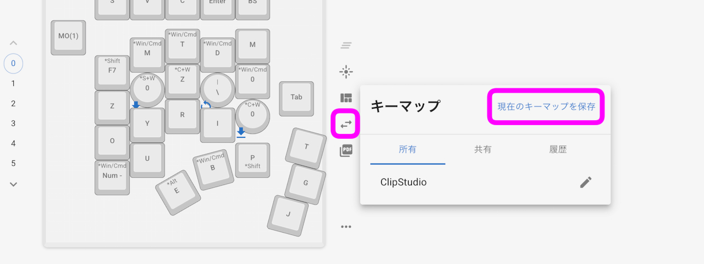
共有すると他の人に自分の設定を使ってもらうことができます。自由に登録してください。

### 設定のリセット
画像のマークから設定をリセットすることができます。キー以外の設定も初期化できるので困った時は試してみてください。
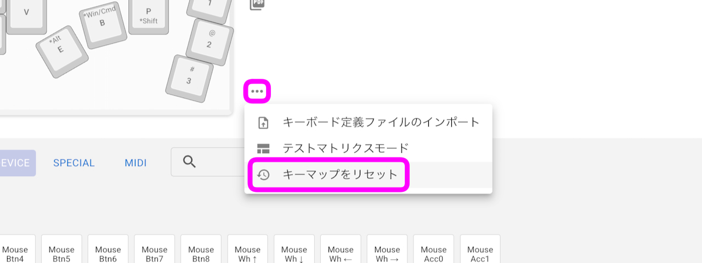

### LEDの設定
LEDを取り付けている場合は画像のマークをクリックすると発光を調節できます。
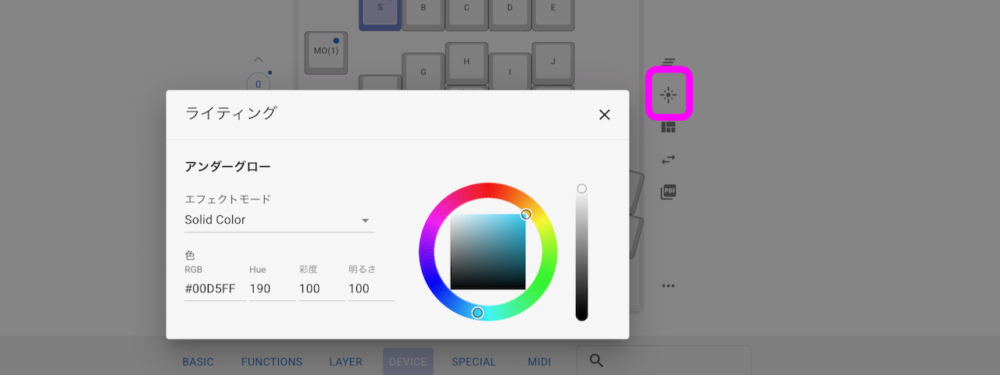

### RGBレイヤー機能
レイヤーを変更するとLEDの色が変わります。
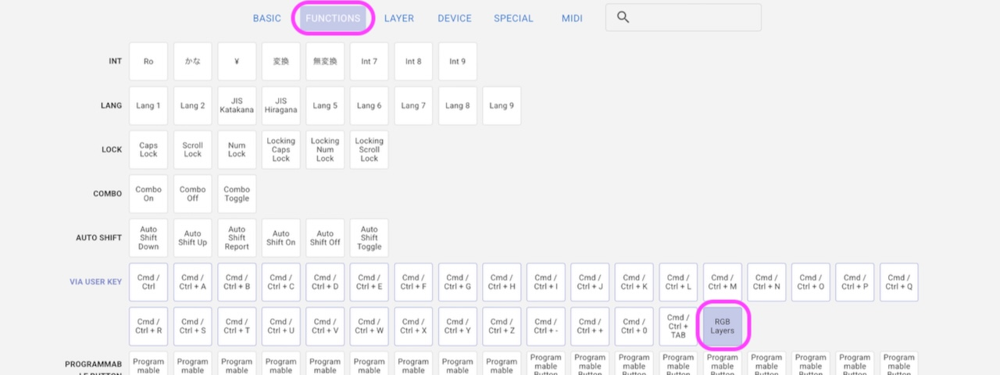
この機能をオン/オフするにはFUNCTIONSタブのRGB Layerのキーを登録して押します。

[スタートページに戻る](../README.md)
