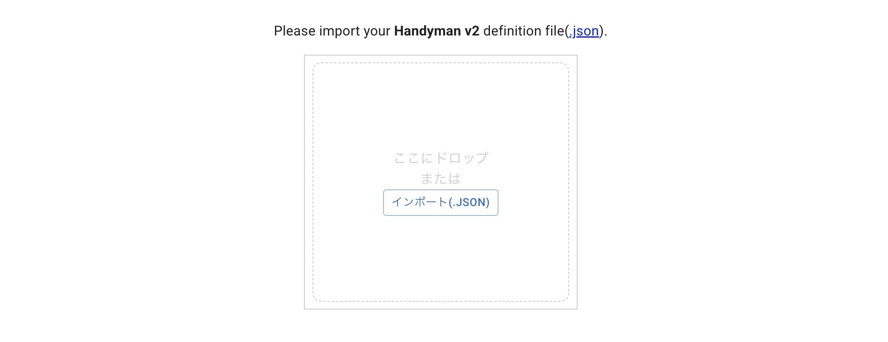

# How to Use ([日本語](./USAGE.md))

In addition to the key switch, the following actions can be configured.

## How to Swap Keys
Connect to Remap using Google Chrome and select Customize.

- [Remap](https://remap-keys.app/)

Drag and drop this JSON file here.

- [handymanv2.json](https://github.com/Taro-Hayashi/Handyman-v2/releases/latest/download/handymanv2.json)

Drag and drop the key, then press the write button in the upper right to change the settings.

### Wheel and Dial Settings
Settings can be configured using the round icon.

Click the mark in the lower left to set clockwise rotation, counterclockwise rotation, and rotation when pressed.

### Use shortcuts
To configure simultaneous presses with modifier keys (such as Ctrl), click the key you wish to set.

When you enter text in the keycode field, suggestions will appear; click to select one.

Check the boxes for the modifier keys you want to press simultaneously to complete the settings.

### Use Hold/Tap
You can also configure it so that a short press enters the key, while a long press activates the modifier key.

Set the modifier key for the Hold function and the key you want to input for the Tap function in the Hold/Tap tab.

### Layer Settings
Click the number on the left to set keys for different layers. 

Switching layers allows you to change the entire set of settings, effectively increasing the number of keys.

Pressing the TG(number) key will switch to the specified layer thereafter. 
MO (number) switches to the specified layer only while the key is pressed.

MO can be used like a laptop's Fn key to function as a different key when pressed simultaneously. Additionally, assigning MO to a slide switch allows you to toggle between different settings when switched on and off, which is convenient.

When using MO, specify the same MO or the ▽ key for the same key on the destination layer. The ▽ key is the key used to temporarily press the key from the previous layer.

### Special keys
The VIA USER KEY in the FUNCTIONS tab has a convenient key that is Control on Windows and Command on Mac or iPad.

We've also prepared keys for simultaneous presses with A~Z, the numeric keypad's ±, 0, and Tab.

### Save Settings
Click the icon to save or restore your settings. You must log in with a Google or GitHub account.

Sharing allows others to use your settings. Feel free to register.

### Reset Settings
You can reset settings from the icon in the image. This also initializes settings other than the key, so try it when you're having trouble.

### LED Settings
If you have an LED installed, you can adjust its brightness by clicking the icon shown in the image.

### RGB Layer Function
Changing the layer will change the LED color.

To turn this feature on or off, register the RGB Layer key in the FUNCTIONS tab and press it.

[Back to Start Page](../README.md)
